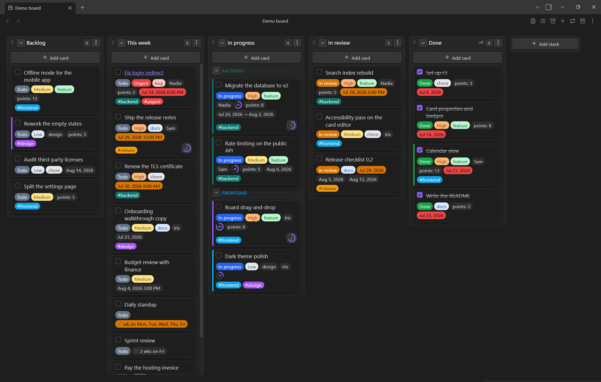
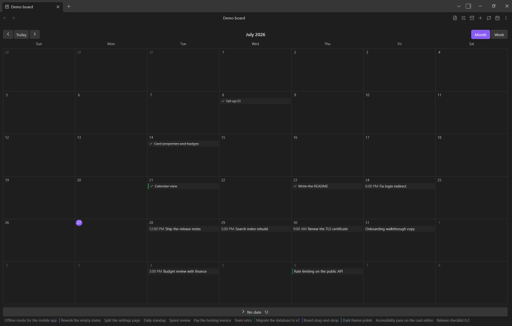

# Extraboard

A Markdown-backed Kanban, calendar and list board plugin for [Obsidian](https://obsidian.md).

Each board is a single Markdown file: stacks are headings, cards are list items,
and card properties are stored inline. The board is deserialized on open and
re-serialized on every change, so the underlying note stays clean and portable.
Designed to be mobile-friendly.

Inspired by [obsidian-kanban](https://github.com/obsidian-community/obsidian-kanban)
by mgmeyers and the Obsidian community — Extraboard is an independent plugin
with its own file format, not a fork.





## Features

- **Your board is a normal note.** `## Heading` is a stack, `- item` is a card,
  and the board's configuration is JSON in an `extraboard-settings` code block at
  the top of the file. Frontmatter carries a single `extraboard: true` marker;
  anything else you keep there — including comments — survives a load/save cycle
  untouched.
- **Three views over the same file:** a Kanban board, a month/week calendar, and
  a **list** that groups every card by its named dividers into collapsible
  sections — each one sortable by date and filterable by tag, with a composer
  that picks which stack the new card goes to. A board can define several views
  and cycle through them from its header, and a new board can open as a list
  instead of a board.
- **Drag and drop** cards within and across stacks, whole stacks, and cards onto
  a calendar day to move their date. Touch drag works on mobile.
- **Typed card properties** written inline as `@{name|value}`: text, number,
  percent, checkbox, color, single-select and multi-select lists with per-value
  badge colors, date, date range, list of dates, and recurrence.
- **Recurring dates** in a readable phrase — `every 2 weeks on Fri`,
  `every month on the last Friday` — expanded onto the calendar.
- **Date highlighting:** ordered rules color a date badge as its date approaches
  or after it has passed; a board can override the plugin-wide list.
- **Nested checklists** on a card with automatic `N/M` progress, shown as a ring,
  a fraction or a percentage.
- **A note per card:** link a card to its own note, created on demand in a folder
  you choose, with hover previews and Obsidian's rename handling.
- **Archive** section in the same file: archived cards remember the stack they
  came from and can be restored or deleted from the archive view.
- **Stacks and dividers that mean something:** a stack can mark the cards
  entering it as done, and a named divider can color the cards in its group.
- **Tags** with per-board colors; selecting one searches the vault for it.
- **English and Russian interfaces**, with configurable date/time formats
  (including relative dates and custom `moment.js` patterns) and first day of
  the week.

## Status

**Early development** — the MVP is being implemented milestone by milestone.
Everything listed above works; what is left before a first release is a pass
over mobile verification, packaging and release automation. This section will be
replaced with setup and usage instructions once the MVP is complete.

## Development

```bash
npm install       # install dependencies
npm run dev       # watch build
npm run build     # production build (tsc type-check + esbuild bundle)
npm run lint      # eslint
npm test          # run the unit tests
```

The build assembles the complete plugin into **`dist/`** (`main.js`,
`manifest.json`, `styles.css`). For manual testing, copy or symlink `dist/` to
`<Vault>/.obsidian/plugins/extraboard/`, then reload Obsidian and enable the
plugin under **Settings → Community plugins**.

## License

0-BSD — see [LICENSE](LICENSE).
